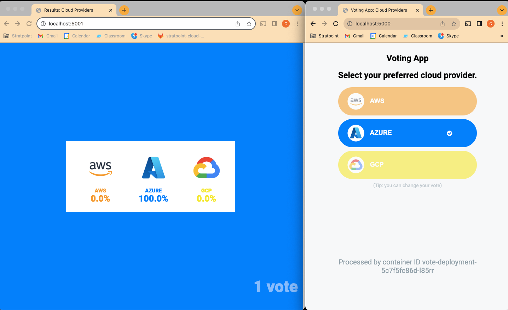
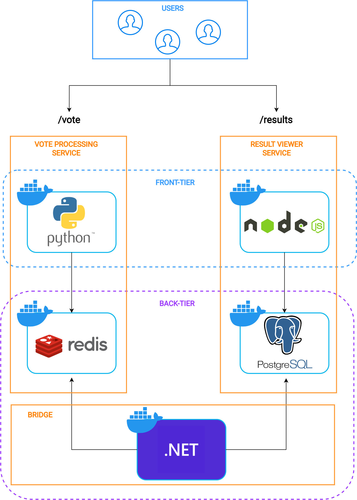

# Cloud Native (Foundational) - Final Project Documentation

Synthesis: This final project is a comprehensive application comprising multiple containerized microservices which are combined into a cluster handled by kubernetes. The application's primary function is a Python-based voting web app and a JavaScript real-time dashboard. Using Redis for caching and a custom worker for PostgreSQL database writes.

The foundational knowledge for building this project comes from the whole bootcamp itself. Familiarity with basic Docker concepts, containerization, yaml construction, and kubectl commands is imperative for understanding this final project.

# Requirements:

- Req. 1 – Build, tag, and push container image for each component.
  - This requirement was met by first creating a dockerfile for each application (vote and result) and tagging it with my dockerhub repo (kobesergio) which are then pushed to dockerhub to be used on docker-compose and kubernetes.
- Req. 2 – Ensure that all packages and container artifacts pass a security/vulnerability scan.
  - For each dockerfile I first tested security/vulnerbility scan on the vote component using the RUN command and installing curl (RUN apt-get update && apt-get install -y curl && rm -rf /var/lib/apt/lists/\*)
- Req. 3 – Create manifest files for the containerized workload and deploy them in a cluster.
- Req. 4 – Make use of configmap and secrets as best practices (especially for credentials).
  - After compiling the dockerfiles and making sure they run nicely, I first tested the docker-compose.yml to test whether the docker files work smoothly and this is also where I got a jist of how the ports interact, after which I created the manifest files for the ff:
    - deployment.yml (./kubernetes/deployment.yml) - This file describes the deployment configurations for six distinct components in a Kubernetes cluster. It includes a Redis cache using the alpine image, a PostgreSQL database with environment variables sourced from a config map, a voting service, a results service, a worker service, and an Nginx proxy. Each service runs a single replica, and health checks are defined for Redis and the PostgreSQL database to ensure their proper operation.
    - service.yml (./kubernetes/services.yml) - The services.yml file defines Kubernetes services for various components. It sets up internal ClusterIP services for Redis and a PostgreSQL database, exposing them on their respective default ports. Additionally, voting, results, and proxy services are configured as LoadBalancer services, making them accessible externally. Both the voting and results services share the same external IP, and the proxy service operates on the standard HTTP port.
    - configmap.yml (./kubernetes/configmap.yml) - The configmap.yml file defines a Kubernetes ConfigMap named "final-project-configmap." This ConfigMap stores configuration data, specifically containing credentials for a PostgreSQL database, which includes a username ("postgres") and a password ("postgres").

### Output

### Architecture

